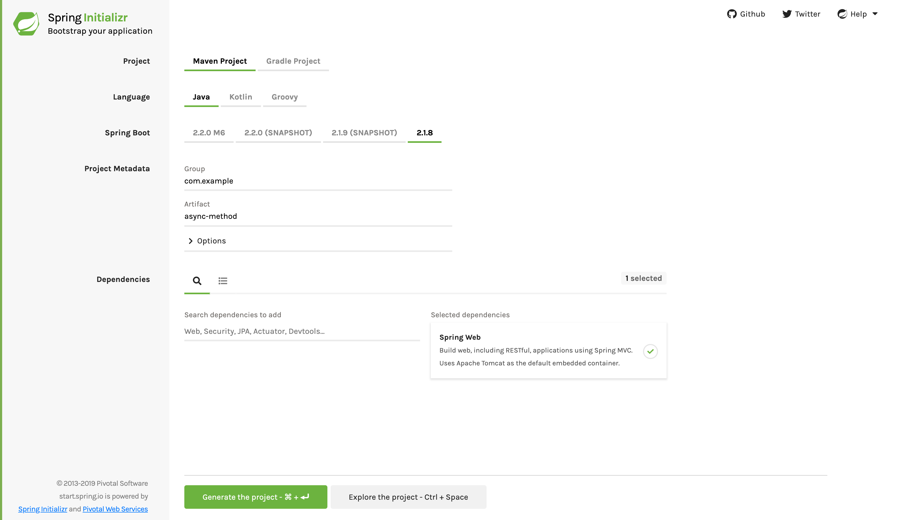

:spring_version: current
:spring_boot_version: 2.2.1.RELEASE
:jackson: https://wiki.fasterxml.com/JacksonHome
:SpringApplication: https://docs.spring.io/spring-boot/docs/{spring_boot_version}/api/org/springframework/boot/SpringApplication.html
:EnableAsync: https://docs.spring.io/spring/docs/current/spring-framework-reference/html/scheduling.html#scheduling-annotation-support
:Future: https://docs.oracle.com/javase/8/docs/api/java/util/concurrent/Future.html
:CompletableFuture: https://docs.oracle.com/javase/8/docs/api/java/util/concurrent/CompletableFuture.html
:Executor: https://docs.spring.io/spring-framework/docs/current/spring-framework-reference/integration.html#scheduling-task-executor
:runner: https://docs.spring.io/spring-boot/docs/current/reference/htmlsingle/#boot-features-command-line-runner
:toc:
:icons: font
:source-highlighter: prettify
:project_id: gs-async-method
:EnableAsyncJavadoc: https://docs.spring.io/spring-framework/docs/current/javadoc-api/org/springframework/scheduling/annotation/EnableAsync.html

This guide walks you through creating asynchronous queries to GitHub. The focus is on the
asynchronous part, a feature often used when scaling services.

== What You Will build

You will build a lookup service that queries GitHub user information and retrieves data
through GitHub's API. One approach to scaling services is to run expensive jobs in the
background and wait for the results by using Java's
{CompletableFuture}[`CompletableFuture`] interface. Java's `CompletableFuture` is an
evolution from the regular `Future`. It makes it easy to pipeline multiple asynchronous
operations and merge them into a single asynchronous computation.

== What You Need

:java_version: 1.8
include::https://raw.githubusercontent.com/spring-guides/getting-started-macros/master/prereq_editor_jdk_buildtools.adoc[]

include::https://raw.githubusercontent.com/spring-guides/getting-started-macros/master/how_to_complete_this_guide.adoc[]

[[scratch]]
== Starting with Spring Initializr

For all Spring applications, you should start with the https://start.spring.io[Spring
Initializr]. The Initializr offers a fast way to pull in all the dependencies you need for
an application and does a lot of the set up for you. This example needs only the Spring
Web dependency. The following image shows the Initializr set up for this sample project:

NOTE: The preceding image shows the Initializr with Maven chosen as the build tool. You
can also use Gradle. It also shows values of `com.example` and `async-method` as the Group
and Artifact, respectively. You will use those values throughout the rest of this sample.

The following listing shows the `pom.xml` file created when you choose Maven:

====
[src,xml]
----
include::complete/pom.xml[]
----
====

The following listing shows the `build.gradle` file created when you choose Gradle:

====
[src,groovy]
----
include::complete/build.gradle[]
----
====

[[initial]]
== Create a Representation of a GitHub User

Before you can create a GitHub lookup service, you need to define a representation for the
data you will retrieve through GitHub's API.

To model the user representation, create a resource representation class. To do so,
provide a plain old Java object with fields, constructors, and accessors, as the following
example (from `src/main/java/com/example/asyncmethod/User.java`) shows:

====
[source,java,tabsize=2]
----
include::complete/src/main/java/com/example/asyncmethod/User.java[]
----
====
Spring uses the {jackson}[Jackson JSON] library to convert GitHub's JSON response into a
`User` object. The `@JsonIgnoreProperties` annotation tells Spring to ignore any
attributes not listed in the class. This makes it easy to make REST calls and produce
domain objects.

In this guide, we grab only the `name` and the `blog` URL for demonstration purposes.

== Create a GitHub Lookup Service

Next, you need to create a service that queries GitHub to find user information. The
following listing (from `src/main/java/com/example/asyncmethod/GitHubLookupService.java`) shows how to do so:

====
[source,java,tabsize=2]
----
include::complete/src/main/java/com/example/asyncmethod/GitHubLookupService.java[]
----
====

The `GitHubLookupService` class uses Spring's `RestTemplate` to invoke a remote REST point
(api.github.com/users/) and then convert the answer into a `User` object. Spring Boot
automatically provides a `RestTemplateBuilder` that customizes the defaults with any
auto-configuration bits (that is, `MessageConverter`).

The class is marked with the `@Service` annotation, making it a candidate for Spring's
component scanning to detect and add to the application context.

The `findUser` method is flagged with Spring's `@Async` annotation, indicating that it
should run on a separate thread. The method's return type is
{CompletableFuture}[`CompletableFuture<User>`] instead of `User`, a requirement for any
asynchronous service. This code uses the `completedFuture` method to return a
`CompletableFuture` instance that is already completed with result of the GitHub query.

NOTE: Creating a local instance of the `GitHubLookupService` class does NOT allow the
`findUser` method to run asynchronously. It must be created inside a `@Configuration`
class or picked up by `@ComponentScan`.

The timing for GitHub's API can vary. To demonstrate the benefits later in this guide, an
extra delay of one second has been added to this service.

== Make the Application Executable

To run a sample, you can create an executable jar. Spring's `@Async` annotation works with
web applications, but you need not set up a web container to see its benefits. The
following listing (from
`src/main/java/com/example/asyncmethod/AsyncMethodApplication.java`) shows how to do so:

====
[source,java,tabsize=2]
----
include::complete/src/main/java/com/example/asyncmethod/AsyncMethodApplication.java[]
----
====

NOTE: The Spring Initalizr created an `AsyncMethodApplication` class for you. You can find
it in the zip file that you downloaded from the Spring Initalizr (in
`src/main/java/com/example/asyncmethod/AsyncMethodApplication.java`). You can either copy
that class to your project and then modify it or copy the class from the preceding
listing.

include::https://raw.githubusercontent.com/spring-guides/getting-started-macros/master/spring-boot-application-new-path.adoc[]

The {EnableAsync}[`@EnableAsync`] annotation switches on Spring's ability to run `@Async`
methods in a background thread pool. This class also customizes the `Executor` by defining
a new bean. Here, the method is named `taskExecutor`, since this is the
{EnableAsyncJavadoc}[specific method name for which Spring searches]. In our case, we want
to limit the number of concurrent threads to two and limit the size of the queue to 500.
There are {Executor}[many more things you can tune]. If you do not define an `Executor`
bean, Spring creates a `SimpleAsyncTaskExecutor` and uses that.

There is also a {runner}[`CommandLineRunner`] that injects the `GitHubLookupService` and
calls that service three times to demonstrate the method is executed asynchronously.

You also need a class to run the application. You can find that in
`src/main/java/com/example/asyncmethod/AppRunner.java`. The following listing shows that
class:

====
[source,java,tabsize=2]
----
include::complete/src/main/java/com/example/asyncmethod/AppRunner.java[]
----
====

include::https://raw.githubusercontent.com/spring-guides/getting-started-macros/master/build_an_executable_jar_subhead.adoc[]

include::https://raw.githubusercontent.com/spring-guides/getting-started-macros/master/build_an_executable_jar_with_both.adoc[]

The application shows logging output, showing each query to GitHub. With the help of the
`allOf` factory method, we create an array of `CompletableFuture` objects. By calling
the `join` method, it is possible to wait for the completion of all of the
`CompletableFuture` objects.

The following listing shows typical output from this sample application:

====
----
2016-09-01 10:25:21.295  INFO 17893 --- [ GithubLookup-2] hello.GitHubLookupService                : Looking up CloudFoundry
2016-09-01 10:25:21.295  INFO 17893 --- [ GithubLookup-1] hello.GitHubLookupService                : Looking up PivotalSoftware
2016-09-01 10:25:23.142  INFO 17893 --- [ GithubLookup-1] hello.GitHubLookupService                : Looking up Spring-Projects
2016-09-01 10:25:24.281  INFO 17893 --- [           main] hello.AppRunner                          : Elapsed time: 2994
2016-09-01 10:25:24.282  INFO 17893 --- [           main] hello.AppRunner                          : --> User [name=Pivotal Software, Inc., blog=https://pivotal.io]
2016-09-01 10:25:24.282  INFO 17893 --- [           main] hello.AppRunner                          : --> User [name=Cloud Foundry, blog=https://www.cloudfoundry.org/]
2016-09-01 10:25:24.282  INFO 17893 --- [           main] hello.AppRunner                          : --> User [name=Spring, blog=https://spring.io/projects]
----
====

Note that the first two calls happen in separate threads (`GithubLookup-2`,
`GithubLookup-1`) and the third one is parked until one of the two threads became
available. To compare how long this takes without the asynchronous feature, try
commenting out the `@Async` annotation and runing the service again. The total elapsed
time should increase noticeably, because each query takes at least a second. You can
also tune the `Executor` to increase the `corePoolSize` attribute for instance.

Essentially, the longer the task takes and the more tasks are invoked simultaneously, the
more benefit you see from making things asynchronous. The trade off is handling the
`CompletableFuture` interface. It adds a layer of indirection, because you are no longer
dealing directly with the results.

== Summary

Congratulations! You have just developed an asynchronous service that lets you scale
multiple calls at once.

== See Also

The following guides may also be helpful:

* https://spring.io/guides/gs/serving-web-content/[Serving Web Content with Spring MVC]
* https://spring.io/guides/gs/spring-boot/[Building an Application with Spring Boot]

include::https://raw.githubusercontent.com/spring-guides/getting-started-macros/master/footer.adoc[]
